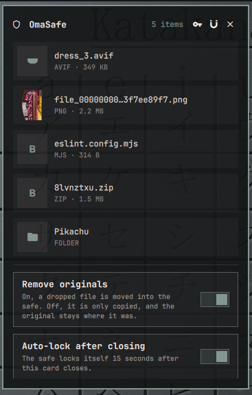
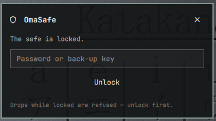
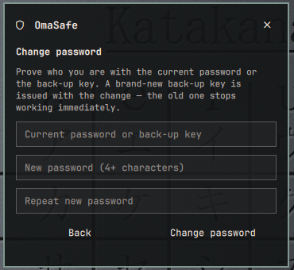

# OmaSafe



| Locked | Change password |
| --- | --- |
|  |  |

An encrypted drop-safe for Omarchy's bar. Drag files, media, or whole folders
onto the safe and they are locked away: each file is encrypted with
AES-256-CBC (PBKDF2, 250k iterations) and the original is removed. Opening
the safe shows a small file explorer — browse folders, switch between list
and grid, and drop files into the folder you're looking at — and lets you
unlock items back to `~/Downloads/OmaSafe` or destroy them.

## Install

```bash
omarchy plugin add https://github.com/palccod/OmaSafe --enable
```

## How it works

- **Lock something away** — drag files or folders onto the bar icon (works
  mid-drag, no click needed first), onto the open card, or straight onto a
  folder inside the card to file it there. Symlinks are refused; everything
  else is fair game.
- **Browse** — folders are stored as real structure (one encrypted blob per
  file), so clicking a folder shows its contents instantly, with nothing
  decrypted until you take an item out. Drop files while a folder is open and
  they land inside it. Safes from before 0.4.0 stored a folder as one tar
  blob; on the first unlock they are upgraded to the browsable layout
  automatically.
- **Unlock** — click the shield and type your password. A back-up key
  (64 hex digits) also opens the safe and is stored nowhere; if you lose
  both the password and the key, the contents are gone.
- **Change password** — the key button in the card (or the banner that
  appears after unlocking with the back-up key). Prove who you are with the
  current password **or** the back-up key; on success both wraps are
  rewritten and a brand-new back-up key is issued, shown exactly once. The
  old back-up key stops working immediately; the encrypted items themselves
  are not touched.
- **Drag out** — press an item in the card and drag it straight into any
  window (file manager, editor, chat): the item is decrypted to a tmpfs
  staging area and the drag carries a normal `file://` url, so the target
  takes a plain copy. Staged plaintext is wiped when the safe locks, or
  after ten minutes at the latest.
- **Extract** — the download button on an item decrypts it into
  `~/Downloads/OmaSafe` (renaming on collision, never overwriting).
- **Destroy** — the trash button erases the encrypted copy for good, after
  a confirmation.
- **Auto-lock** — the safe locks itself 15 seconds after the card closes
  (configurable in the card, or disable it). Locking also happens on
  `omarchy-shell palccod.omasafe.vault lock` and at shell shutdown.

## Privacy model

The vault lives in `~/.local/share/.omasafe/vault/` (mode 700). Everything
in it is ciphertext with random hex filenames — no extensions, no names, no
plaintext index. A file manager can open the folder and learn nothing:
item names, sizes, and dates are inside `index.enc`, which is itself
encrypted under the vault key. The vault key is wrapped twice on disk —
`wrap.enc` under your password and `recovery.enc` under the back-up key —
and exists in memory only while the safe is unlocked; neither the password
nor the back-up key is stored anywhere. Plaintext exists on disk only for
the milliseconds an operation takes, in a tmpfs scratch directory under
`XDG_RUNTIME_DIR`, and is deleted immediately — the one exception is the
drag-out staging area, which holds a decrypted copy from the moment you
press an item until you drop it (and never longer than ten minutes or the
next lock).

Safes created before back-up keys were separate from the vault key are
upgraded automatically on their first unlock: a fresh back-up key is issued
and shown once, and the old key (which was the raw vault key) is no longer
accepted.

## Preferences

Toggles live at the bottom of the card:

- **Remove originals** — on (default), dropping a file moves it into the
  safe. Off, it is copied and the original stays put. Deletion is only ever
  attempted for paths inside your home directory.
- **Auto-lock after closing** — on (default, 15s).

## CLI

```bash
omarchy-shell palccod.omasafe.vault status      # {"phase":"locked","items":3,...}
omarchy-shell palccod.omasafe.vault lock        # lock now
omarchy-shell palccod.omasafe open              # open the card
omarchy-shell palccod.omasafe.vault stash '{"paths":["/home/you/photo.jpg"]}'
```

`stash` requires an unlocked safe and takes file paths (or `file://` urls),
one or many.

## Requirements

Nothing beyond Omarchy itself: encryption uses the system `openssl`,
archiving uses `tar`, and the clipboard copy uses `wl-copy`.

## Remove

```bash
omarchy plugin remove palccod.omasafe --yes
```

Removing the plugin leaves the vault in place — delete
`~/.local/share/.omasafe/` if you want the encrypted contents gone too.

## License

MIT — see [LICENSE](LICENSE). External dependencies: system `openssl`, `tar`,
and `wl-copy` (wl-clipboard); no bundled binaries, no network access.
