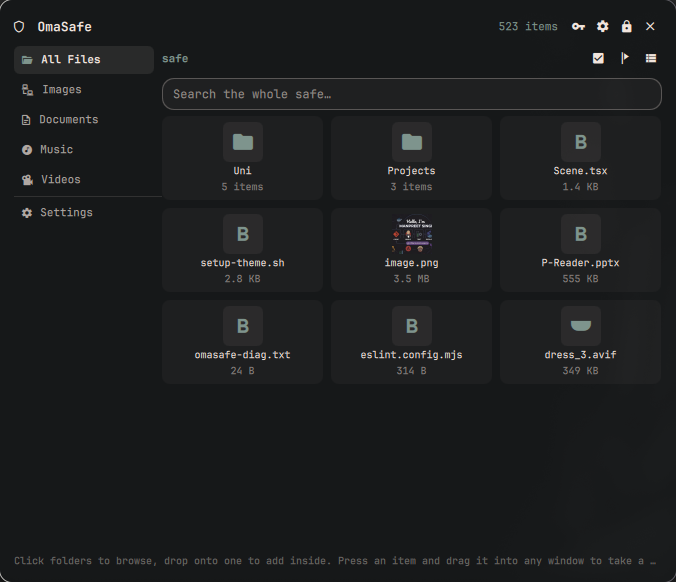
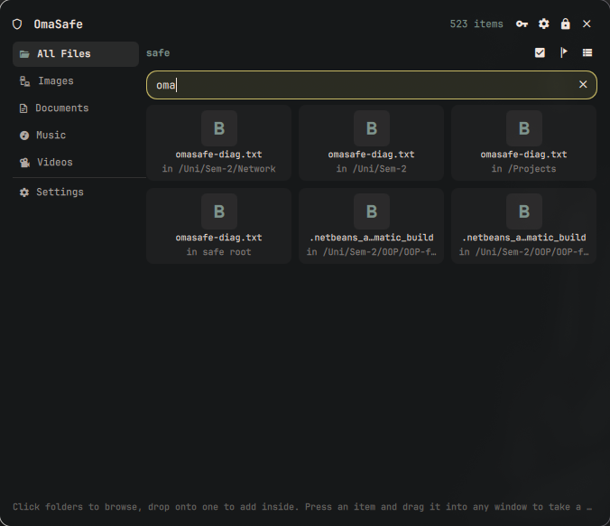
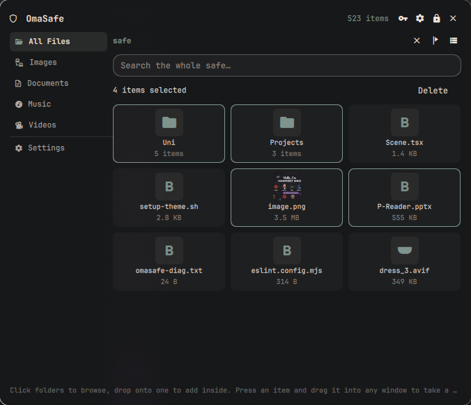
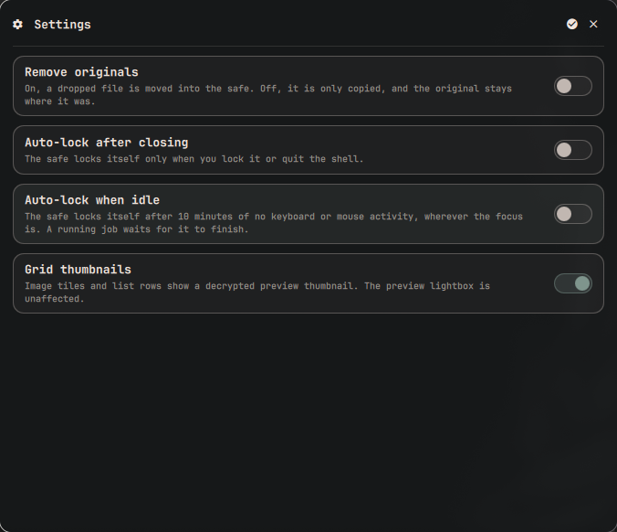
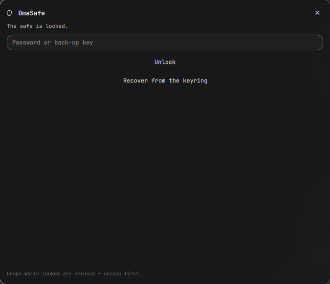
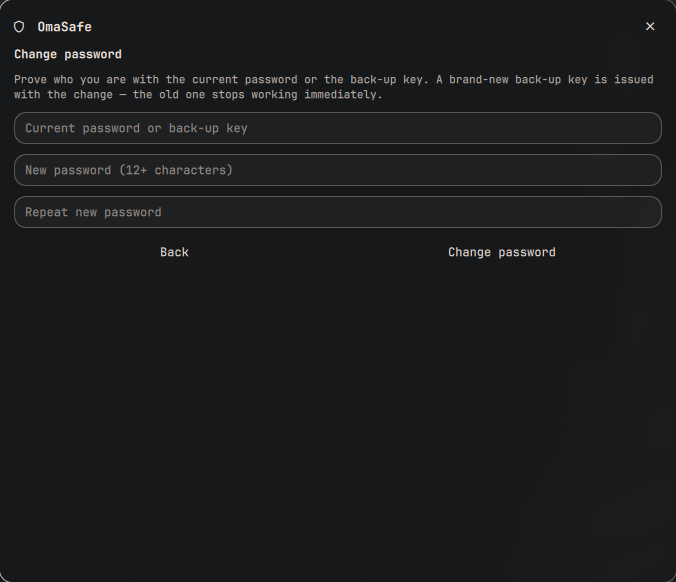

# OmaSafe



An encrypted drop-safe for Omarchy's bar. Drag files, media, or whole folders
onto the safe and they are locked away: each file is encrypted with
AES-256-CBC under a key behind a 250,000-iteration PBKDF2 stretch and sealed
with an HMAC-SHA256 authentication tag whose key sits behind the same
stretch, and the tag is verified before anything is ever decrypted — a
tampered file is refused, not opened — and the original is removed. Opening
the safe opens a floating, resizable file explorer: a sidebar that filters
the whole vault by type, whole-vault search, list and grid views with image
thumbnails, undoable deletes, a preview lightbox, and drop-into-folder
filing. Safes from before 0.6.0 are upgraded to the authenticated format
automatically, a few files at a time, on the first unlock after the update;
safes from before 1.6.2 have their password wrap re-wrapped in the fully
stretched format on the first password unlock after the update.

| Whole-vault search | Multi-select |
| --- | --- |
|  |  |

| Settings | Locked |
| --- | --- |
|  |  |

| Change password |
| --- |
|  |

## Install

```bash
omarchy plugin add https://github.com/palccod/OmaSafe --enable
```

## How it works

- **Open the safe** — click the shield in the bar and a floating window
  opens: drag it anywhere, resize it to taste, and it stays up while you
  work elsewhere. It reopens at its default size every time.
- **Lock something away** — drag files or folders onto the bar icon (works
  mid-drag, no click needed first), onto the open window, or straight onto
  a folder inside it to file it there. Symlinks are refused; everything
  else is fair game.
- **Browse** — folders are stored as real structure (one encrypted blob per
  file), so clicking a folder shows its contents instantly, with nothing
  decrypted until you take an item out. The sidebar filters the whole vault
  by type — All Files, Images, Documents, Music, Videos — and the toolbar
  sorts by name, newest added, or largest, in grid or list view with image
  thumbnails. Safes from before 0.4.0 stored a folder as one tar blob; on
  the first unlock they are upgraded to the browsable layout automatically.
- **Search** — the search bar filters the whole vault by name. Results show
  where they live ("in /projects"), and clicking one jumps to its folder.
- **Multi-select** — the checkbox in the toolbar turns clicks into picks.
  Drag the selection into any app as a batch, or Delete it in one stroke.
- **Delete & undo** — deleting is instant and undoable: a toast offers Undo
  for a few seconds while the encrypted copy is still on disk, and Undo
  restores the very same items without re-encrypting anything. Bulk delete
  is one undoable batch. (There is no confirmation dialog — the undo is the
  confirmation.)
- **Preview** — click a file to view it in place: images large, text files
  as text (scrolling), with arrow keys stepping through the files of the
  current view.
- **Unlock** — type your password. A back-up key (64 hex digits) also opens
  the safe and is stored nowhere; if you lose both the password and the
  key, the contents are gone.
- **Change password** — the key button in the header (or the banner that
  appears after unlocking with the back-up key). Prove who you are with the
  current password **or** the back-up key; on success both wraps are
  rewritten and a brand-new back-up key is issued, shown exactly once. The
  old back-up key stops working immediately; the encrypted items themselves
  are not touched.
- **Keyring back-up (optional)** — while the back-up key is on screen,
  "Save in a keyring" copies it into a dedicated `OmaSafe` keyring with its
  own password — one that logging in does **not** unlock. If the vault
  password is ever lost, "Recover from the keyring" on the unlock card pops
  the keyring's password dialog and opens the safe with the copy. Changing
  the password issues a fresh back-up key, so the banner offers to refresh
  the keyring copy too. Deleting the keyring or its item (from seahorse or
  any keyring manager) revokes nothing — the vault never depends on it.
- **Drag out** — press an item and drag it straight into any window (file
  manager, editor, chat): the item is decrypted to a tmpfs staging area and
  the drag carries a normal `file://` url, so the target takes a plain
  copy. In select mode the drag carries the whole selection. Staged
  plaintext is wiped when the safe locks, or after ten minutes at the
  latest.
- **Extract** — the download button on an item decrypts it into
  `~/Downloads/OmaSafe` (renaming on collision, never overwriting).
- **Auto-lock** — the safe locks itself 15 seconds after the window closes
  and, optionally, after ten minutes of no input; both are toggles in the
  settings. Locking also happens on
  `omarchy-shell palccod.omasafe.vault lock` and at shell shutdown.
- **Settings** — the cog in the header (or the sidebar's Settings entry):
  remove-originals, both auto-locks, grid thumbnails. Sort, layout, and
  every preference persist across restarts.

## Privacy model

The vault lives in `~/.local/share/.omasafe/vault/` (mode 700). Everything
in it is authenticated ciphertext with random hex filenames — no extensions,
no names, no plaintext index. A file manager can open the folder and learn
nothing: item names, sizes, and dates are inside `index.enc`, which is
itself encrypted under the vault key, and every encrypted file carries an
HMAC tag so that silent tampering is detected and refused before any of it
is used. The vault key is wrapped twice on disk — `wrap.enc` under your
password and `recovery.enc` under the back-up key — and exists in memory
only while the safe is unlocked; neither the password nor the back-up key
is stored anywhere. Plaintext exists on disk only for the milliseconds an
operation takes, in a private tmpfs scratch directory under `XDG_RUNTIME_DIR`
(where the desktop provides no runtime directory, a freshly randomized
`mktemp -d` directory under `/tmp` is created at boot instead — nothing
predictable to race, sticky `/tmp` keeps other users from touching it once
it exists — and the whole tree is re-verified, owner and mode included,
immediately before every use), and is deleted immediately — the one
exception is the drag-out staging area, which holds a decrypted copy from
the moment you press an item until you drop it (and never longer than ten
minutes or the next lock).

Safes created before back-up keys were separate from the vault key are
upgraded automatically on their first unlock: a fresh back-up key is issued
and shown once, and the old key (which was the raw vault key) is no longer
accepted. Safes created before 0.6.0 are likewise upgraded to the
authenticated format on their next unlocks — the password wrap is re-sealed
at the first password unlock, the back-up wrap at the first back-up-key
unlock (a password unlock re-issues the back-up key instead, since the old
wrap can only be re-sealed by whoever holds that key), and every file blob
is re-tagged in place in the background until the whole vault is
authenticated.

### The keyring copy

The optional keyring back-up stores the back-up key in a dedicated
`OmaSafe` keyring — a separate collection in your secret service with a
password you pick, distinct from the login keyring your session unlocks.
Consequences worth knowing:

- Reading the copy requires the keyring's password, entered into the native
  GNOME keyring dialog; an unlocked session alone never exposes it. The
  plugin re-locks the keyring after every save and recovery, so each use
  asks for that password again.
- Anything that *can* satisfy that dialog can open the safe. If you forget
  both the vault password and the keyring password, the keyring copy is
  useless — the paper/password-manager copy of the back-up key remains the
  real back-up.
- A password change invalidates the keyring copy until you re-save it (the
  banner reminds you); recovery with a stale copy simply fails, it never
  half-unlocks.

## Settings

The cog in the header (or the sidebar's Settings entry) opens the settings
page. Everything is saved and survives restarts:

- **Remove originals** — on by default: dropping a file moves it into the
  safe. Off, it is copied and the original stays put. Deletion is only ever
  attempted for paths inside your home directory.
- **Auto-lock after closing** — on by default, 15 seconds.
- **Auto-lock when idle** — off by default; locks the safe after ten
  minutes of no input, wherever the focus is. A running job waits for it to
  finish.
- **Grid thumbnails** — on by default; turns the decrypted preview
  thumbnails off without affecting the preview lightbox.

The listing's sort (name / newest / largest) and the grid-or-list layout
are also remembered.

## CLI

```bash
omarchy-shell palccod.omasafe.vault status      # {"phase":"locked","items":3,...}
omarchy-shell palccod.omasafe.vault lock        # lock now
omarchy-shell palccod.omasafe open              # open the window
omarchy-shell palccod.omasafe toggle            # open or close it
omarchy-shell palccod.omasafe.vault stash '{"paths":["/home/you/photo.jpg"]}'
```

`stash` requires an unlocked safe and takes file paths (or `file://` urls),
one or many.

## Requirements

Nothing beyond Omarchy itself: encryption uses the system `openssl`,
archiving uses `tar`, and the clipboard copy uses `wl-copy`.

The optional keyring back-up additionally needs a Secret Service
(gnome-keyring) with `secret-tool` (libsecret), and `python3` with GObject
introspection for the one-time keyring creation. Without them the rest of
the plugin works unchanged and the keyring buttons simply stay out of the
way.

## Remove

```bash
omarchy plugin remove palccod.omasafe --yes
```

Removing the plugin leaves the vault in place — delete
`~/.local/share/.omasafe/` if you want the encrypted contents gone too.

## License

MIT — see [LICENSE](LICENSE). External dependencies: system `openssl`, `tar`,
and `wl-copy` (wl-clipboard); optionally `secret-tool` (libsecret) and
`python3` + GObject introspection for the keyring back-up. No bundled
binaries, no network access.
